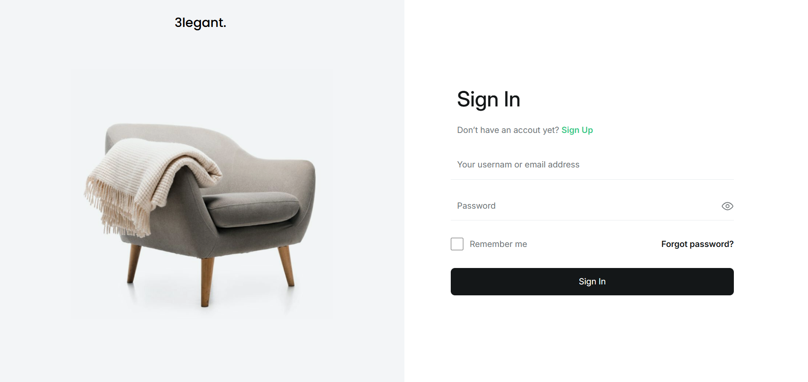
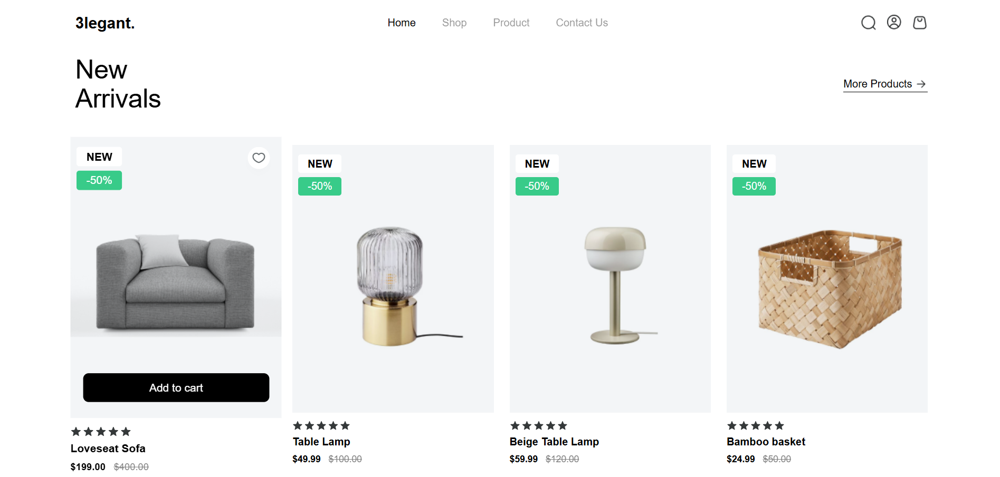
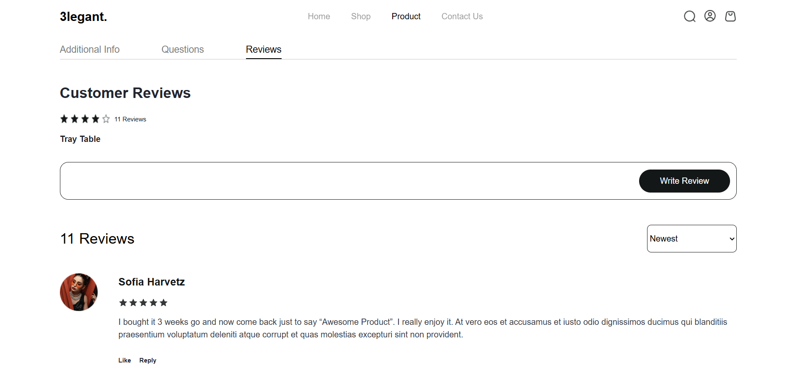
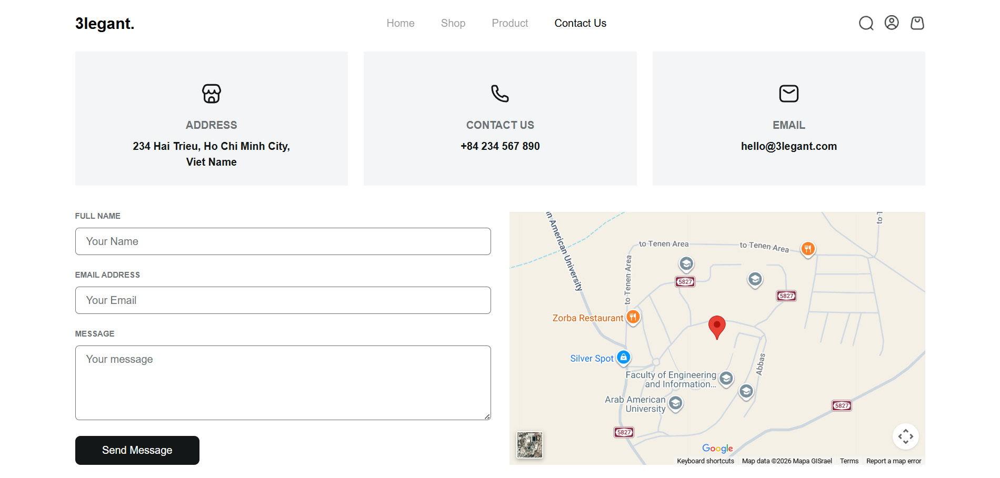
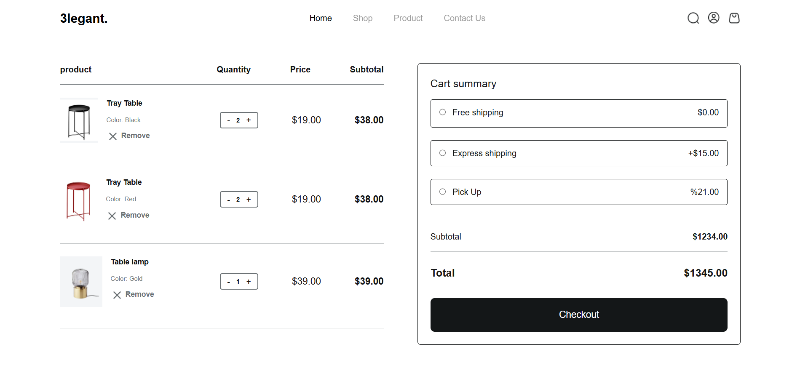
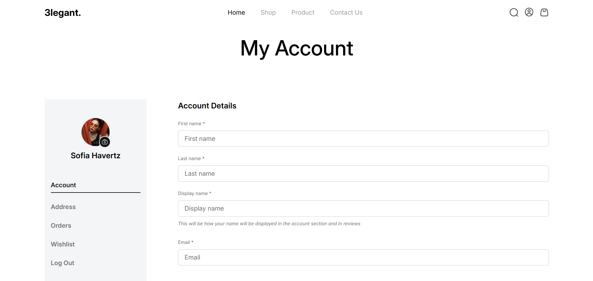

# E-commerce Website

A modern and responsive e-commerce website built with **HTML and Tailwind CSS**.
The project focuses on creating a clean, user-friendly shopping experience with a modern and responsive design.

## Technologies

* HTML5
* Tailwind CSS

## Features

* Fully responsive design
* Modern and clean UI
* Product listing and product details
* Shopping cart
* Interactive hover effects and animations

## Pages

* Home
* Shop
* Product Details
* Cart
* personal account
* login
* Blog
* Contact

## Responsive Design

The website is optimized for: 

- Desktop
- Tablet
- Mobile

## Preview

## Live Demo

[View Live Demo](https://saleh-nairat.github.io/project/)